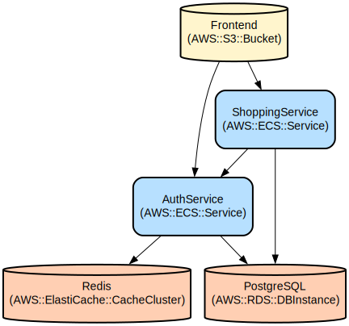

# Full-Stack E-commerce Platform with Microservices Architecture

A modern e-commerce platform built with Spring Boot microservices and React, featuring user authentication, product management, and shopping cart functionality with real-time updates and caching.

This project demonstrates a production-ready microservices architecture that separates authentication and shopping concerns into distinct services. The platform provides secure user authentication with JWT tokens, efficient product caching using Redis, and a responsive React frontend for seamless user experience. The services are containerized using Docker for consistent development and deployment environments.

## Repository Structure
```
.
├── auth-service/              # Authentication microservice
│   ├── src/                  # Source code for auth service
│   │   └── main/
│   │       ├── java/        # Java implementation files
│   │       └── resources/   # Configuration and SQL files
│   ├── Dockerfile           # Container definition for auth service
│   └── pom.xml             # Maven dependencies and build config
├── shopping-service/         # Shopping cart microservice
│   ├── src/                 # Source code for shopping service
│   │   └── main/
│   │       ├── java/       # Java implementation files
│   │       └── resources/  # Configuration and SQL files
│   ├── Dockerfile          # Container definition for shopping service
│   └── pom.xml            # Maven dependencies and build config
├── frontend/                # React frontend application
│   ├── src/                # React source code
│   │   ├── components/    # React components
│   │   └── App.js        # Main application component
│   ├── Dockerfile         # Container definition for frontend
│   └── package.json       # NPM dependencies and scripts
├── docker-compose.yml      # Production Docker composition
├── docker-compose.dev.yml  # Development Docker composition
└── scripts/               # Deployment and database scripts
```

## Usage Instructions
### Prerequisites
- Docker and Docker Compose v3.8+
- Java Development Kit (JDK) 17
- Node.js 18+ (for frontend development)
- Maven 3.9+ (for Java services)
- PostgreSQL 15+ (for local development)

### Installation

1. Clone the repository:
```bash
git clone <repository-url>
cd <repository-name>
```

2. Start the development environment:
```bash
docker-compose -f docker-compose.dev.yml up -d
```

3. Initialize the database:
```bash
./scripts/deploy.sh dev
```

### Quick Start

1. Access the frontend application:
```
http://localhost:3000
```

2. Create a new account using the signup form or login with existing credentials:
```json
{
  "username": "testuser",
  "password": "password123",
  "email": "test@example.com"
}
```

3. Browse products and add items to your cart.

### More Detailed Examples

1. Authentication API Usage:
```bash
# Login
curl -X POST http://localhost:8082/api/auth/login \
  -H "Content-Type: application/json" \
  -d '{"username":"testuser","password":"password123"}'

# Add item to cart
curl -X POST http://localhost:8081/api/shopping/cart/add \
  -H "Content-Type: application/json" \
  -H "Authorization: Bearer <your-token>" \
  -d '{"productId":1,"quantity":2}'
```

### Troubleshooting

1. Service Connection Issues
- Problem: Services cannot connect to Redis or PostgreSQL
- Solution: 
```bash
# Check if services are running
docker-compose ps

# Check service logs
docker-compose logs auth-service
docker-compose logs shopping-service
```

2. Database Issues
- Problem: Database tables not created
- Solution:
```bash
# Reset the database
docker-compose exec postgres psql -U postgres -d shoppingdb -f /docker-entrypoint-initdb.d/init-postgres.sh
```

## Data Flow
The application follows a microservices architecture with separate concerns for authentication and shopping functionality.

```ascii
[Frontend (React)] <---> [Auth Service (8082)] <---> [Redis Cache]
         |                      |
         |                      v
         |               [PostgreSQL DB]
         |                      ^
         v                      |
[Shopping Service (8081)] <-----+
```

Component interactions:
1. Frontend communicates with Auth Service for user authentication
2. Auth Service validates credentials and issues JWT tokens
3. Shopping Service validates tokens with Auth Service
4. Shopping Service manages cart operations and product inventory
5. Redis provides caching for authentication tokens
6. PostgreSQL stores user data and product information

## Infrastructure



### Services
- **Redis**: In-memory data structure store
  - Port: 6379
  - Used for: Token caching and session management

- **PostgreSQL**: Relational database
  - Port: 5432
  - Databases: authdb, shoppingdb
  - Used for: User data and product information

- **Auth Service**: Authentication microservice
  - Port: 8082
  - Debug Port: 5005
  - Dependencies: Redis, PostgreSQL

- **Shopping Service**: Shopping cart microservice
  - Port: 8081
  - Debug Port: 5006
  - Dependencies: PostgreSQL, Auth Service

- **Frontend**: React application
  - Port: 3000
  - Debug Port: 9222
  - Dependencies: Auth Service, Shopping Service

### Networks
- app-network: Bridge network for service communication

### Volumes
- maven-repo: Shared Maven repository
- postgres-data: Persistent PostgreSQL data storage